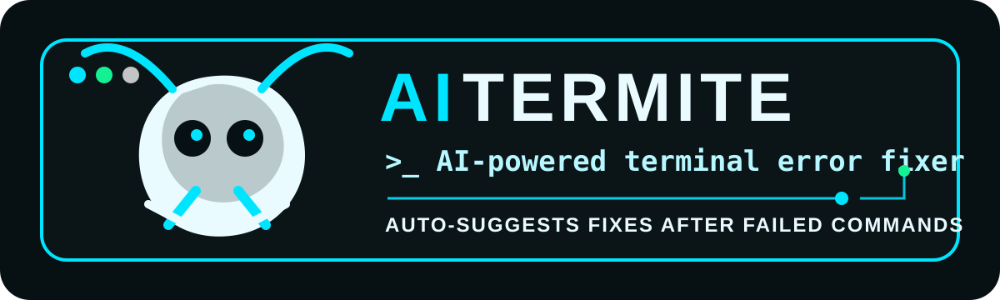

<p align="center">
  
</p>

<p align="center">
  <a href="https://pypi.org/project/aitermite/"></a>
  <a href="https://pypi.org/project/aitermite/"></a>
</p>

# AITERMITE

**AITERMITE** is an AI terminal copilot for Windows, macOS, and Linux. It does two things:

1. **Fixes failed commands** — manually, before Enter where the shell supports it, and automatically after a command fails through shell hooks.
2. **Answers plain thoughts** — type a question at your prompt with *no command and no prefix*; AITERMITE recognises it as natural language, asks Claude or Codex, and if the answer contains runnable shell commands, an arrow-key menu lets you confirm and run one.

## Ask mode (new in v0.5.0)

Just type what you're thinking and press Enter:

```text
$ how do I list the 5 largest files here
AITERMITE · claude
The classic way with find:

  find . -maxdepth 1 -type f -printf '%s %p\n' | sort -rn | head -5

  ↑/↓ move · Enter run · e edit · q cancel
 › [medium] find . -maxdepth 1 -type f -printf '%s %p\n' | sort -rn | head -5
   [medium] du -ah . | sort -rh | head -5
```

- **No prefix needed.** A failed line that looks like natural language is routed to the AI instead of the typo fixer (a real-command typo like `gti status` still goes to the fixer).
- Or be explicit: `ai how do I tar a folder` / `aitermite ask "how do I tar a folder"`.
- **Backends, auto-detected:** the installed [`claude`](https://www.anthropic.com/claude-code) CLI, then `codex`, then a local `ollama`. No API keys required when a CLI agent is signed in. Force one with `--ask-provider claude|codex|ollama` or `AITERMITE_ASK_PROVIDER`.
- **Arrow-key run menu** with per-command risk badges. `Enter` runs the highlighted command through your shell, `e` edits it first, `q` cancels. Commands matching dangerous patterns (e.g. `rm -rf /`) are shown but blocked from running.
- `--json` prints the answer and extracted commands instead of opening the menu (handy for scripts and CI).

## Current packaged release

Latest PyPI release: **v0.5.0 Ask Mode**.

Main features:

- **Ask plain thoughts at the prompt — no command, no prefix.**
- **Answers from the `claude` / `codex` CLIs (auto-detected), or local `ollama`.**
- **Arrow-key menu to confirm and run commands found in the answer.**
- Manual command fixing with `aitermite`.
- Inline fixing with `aitermite <command>`.
- Automatic post-failure suggestion hooks.
- Pre-enter typo detection where supported.
- Ollama local provider support.
- OpenAI fallback support.
- Heuristic offline fallback.
- Windows PowerShell / Windows Terminal support.
- macOS/Linux zsh, bash, and fish support.
- cmd.exe helper macros.
- Clink bootstrap integration for true cmd.exe auto-hooks.
- Secret redaction before provider calls.
- Dangerous command blocking and safety checks.

## Install from PyPI

```bash
python -m pip install aitermite
aitermite --doctor
```

Upgrade to the latest published version:

```bash
python -m pip install --upgrade aitermite
aitermite --version
```

Install a specific version:

```bash
python -m pip install aitermite==0.5.0
```

## Quick start

```bash
aitermite --doctor
aitermite git push                       # fix a command
aitermite ask "how do I tar a folder"    # ask a thought, get an arrow-key run menu
ai how do I free up disk space           # 'ai' alias, after shell integration
aitermite --precheck gti status
aitermite --install-shell auto
```

After shell integration, restart the terminal. AITERMITE then prints suggestions after failed commands, and — where the shell hook is supported — routes a plain natural-language line straight to the AI ask flow with no command or prefix.

## Install from wheel

```bash
python -m pip install aitermite-0.5.0-py3-none-any.whl
aitermite --doctor
```

## Install from source

```bash
git clone https://github.com/sathkruthdamera/AITERMITE.git
cd AITERMITE
python -m pip install -e .
aitermite --doctor
```

## Shell integration

```bash
aitermite --install-shell auto
```

Supported shell targets:

```bash
aitermite --install-shell zsh
aitermite --install-shell bash
aitermite --install-shell fish
aitermite --install-shell powershell
aitermite --install-shell cmd
aitermite --install-shell clink
aitermite --install-shell universal
```

## Automatic post-failure behavior

Target behavior:

```text
Wrong command entered -> command fails -> AITERMITE automatically prints suggestion
```

Example:

```bash
gti status
```

Output:

```text
command not found: gti

AITERMITE suggestion after failed command
Typed: gti status
Fix: git status
Why: Known command typo detected.
Confidence: high (0.94)
Run manually: git status
```

## Provider settings

```bash
export AITERMITE_PROVIDER=auto
export AITERMITE_POSTFAIL_PROVIDER=auto
export AITERMITE_POSTFAIL_TIMEOUT_MS=900
```

For Ollama:

```bash
ollama pull gemma3:latest
export AITERMITE_PROVIDER=ollama
export AITERMITE_OLLAMA_MODEL=gemma3:latest
```

For OpenAI:

```bash
export OPENAI_API_KEY="your_api_key"
export AITERMITE_PROVIDER=openai
```

## Common commands

```bash
aitermite --doctor
aitermite git push
aitermite --json git push
aitermite --precheck gti status
aitermite --postfail 127 gti status
aitermite --install-shell auto
```

## Safety

AITERMITE blocks or avoids risky commands such as destructive delete patterns, `curl | sh`, fork bombs, device writes, shutdown/reboot patterns, and unsupported shell control operators in auto-apply flows.

## Validation from local build

```text
CLI builtin typo tests: 2/2 passed
Precheck tests: 2/2 passed
Redaction tests: 1/1 passed
Safety tests: 3/3 passed
Ask provider tests: 5/5 passed
Command extraction tests: 7/7 passed
NL detection tests: 6/6 passed
Arrow-key menu tests: 6/6 passed
Total targeted tests: 32/32 passed
Pentest checks: passed
Editable install: passed
Wheel build: passed (aitermite-0.5.0-py3-none-any.whl)
CLI smoke test: passed
Version: 0.5.0
```

## Repository import status

This repository has been initialized from ChatGPT. The full v0.4.2 source ZIP and wheel were generated in the workspace. Source import should include:

```text
src/aitermite/
tests/
security/
examples/
assets/
README.md
pyproject.toml
LICENSE
FULL_DOCUMENTATION.md
CROSS_PLATFORM_SHELL_INTEGRATION.md
POSTFAIL_AUTOMATION.md
SHELL_AND_ANIMATION.md
VALIDATION_REPORT.md
```
